# MMPV-RNA v2.3 流程框架图

> 基于昨日实际运行命令行历史绘制 | 2026-06-13

---

## 一、virome_pipeline.py 全架构总览

```mermaid
flowchart TB
    accTitle: MMPV-RNA virome_pipeline.py 10阶段全架构
    accDescr: 从 Raw FASTQ 到 HQ vOTU 的 10 阶段端到端流水线架构, 包含数据清洗/去宿主/组装/鉴定/COBRA延伸/聚类/分类/宿主预测/CheckV/拯救

    subgraph Input["输入层"]
        RAW["Raw FASTQ<br/>--input_reads $RAW/"]
    end

    subgraph Preprocess["预处理层"]
        CL["1. Clean<br/>clean-data.py<br/>Fastp → Seqkit → Clumpify<br/>-t 120 -j 20"]
        DP["2. Deplete<br/>host_depletion.py<br/>Kraken2 → Bowtie2 → rRNA<br/>--host_db ~/database/host_db/<br/>--rrna -t 120 -j 20"]
    end

    subgraph Core["核心分析层"]
        AS["3. Assembly<br/>assembly_pipeline.py<br/>MEGAHIT<br/>-t 20 -j 20 -m 256"]
        ID["4. Identification<br/>virus_identification.py<br/>6工具并行鉴定<br/>--virus_db + 全DB路径<br/>-t 30 -j 10"]
        CO["5. COBRA<br/>cobra_pipeline.py<br/>BWA-MEM2→CoverM→COBRA<br/>auto detect 组装工具<br/>-t 30 -j 10"]
        CLU["6. Cluster<br/>cluster_pipeline.py<br/>CD-HIT ref-guide + vclust Leiden<br/>--ref-genomes ×2<br/>-t 60"]
    end

    subgraph Postprocess["后处理层"]
        TX["7. Taxonomy<br/>virus_classifier.py + R<br/>9工具分类 → R共识<br/>--virus_db + 全DB路径<br/>-t 60"]
        HO["8. Host<br/>run_host_prediction.py<br/>ICTV > RNAVirHost > PhaBOX2<br/>-t 120"]
        CV["9. CheckV<br/>checkv completeness<br/>按宿主预评估<br/>--checkv_db checkv-db-v1.7<br/>-t 120"]
        RE["10. Rescue<br/>rescue_pipeline.py<br/>三支路A→C→D级联拯救<br/>--host-filter Plant<br/>-t 20 -j 10"]
    end

    subgraph Output["输出层"]
        VLD["validate_novel_viruses.py<br/>★known / ★★novel / ★★★truly<br/>→ final_virus_catalog.fasta"]
    end

    RAW --> CL --> DP --> AS --> ID --> CO --> CLU
    CLU --> TX --> HO --> CV --> RE --> VLD

    classDef input fill:#e0f2fe,stroke:#0284c7,color:#0c4a6e
    classDef pre fill:#dcfce7,stroke:#16a34a,color:#14532d
    classDef core fill:#fef9c3,stroke:#ca8a04,color:#713f12
    classDef post fill:#fce7f3,stroke:#db2777,color:#831843
    classDef out fill:#ede9fe,stroke:#7c3aed,color:#4c1d95

    class RAW input
    class CL,DP pre
    class AS,ID,CO,CLU core
    class TX,HO,CV,RE post
    class VLD out
```

---

## 二、virome_pipeline.py 实际运行流程 (昨日命令行)

```mermaid
flowchart LR
    accTitle: 昨日实际运行流程图
    accDescr: 展示 2026-06-13 从 clean 到 rescue 的 10 阶段实际执行顺序及关键参数

    subgraph S1["14:36 — Stage: clean"]
        direction TB
        c1["python virome_pipeline.py --stage clean<br/>--input_reads $RAW/ --output_dir $OUT/<br/>-t 120 -j 20"]
        c1_sub["→ clean-data.py<br/>400样本 PE Fastq → Clean FASTA"]
        c1 --> c1_sub
    end

    subgraph S2["15:27 — Stage: deplete"]
        direction TB
        c2["python virome_pipeline.py --stage deplete<br/>--output_dir $OUT/<br/>--host_db ~/database/host_db/<br/>--aligner bowtie2 --seq_type rna-short --rrna<br/>-t 120 -j 20"]
        c2_sub["→ host_depletion.py<br/>Kraken2 + Bowtie2 + Ribodetector"]
        c2 --> c2_sub
    end

    subgraph S3["16:06 — Stage: assembly"]
        direction TB
        c3["python virome_pipeline.py --stage assembly<br/>--output_dir $OUT/<br/>--input_reads $OUT/00b_HostDepletion/<br/>--assembler megahit<br/>-t 20 -j 20 -m 256 -l 0 --force"]
        c3_sub["→ assembly_pipeline.py<br/>MEGAHIT k-list 21..99"]
        c3 --> c3_sub
    end

    subgraph S4["16:48 — Stage: identification"]
        direction TB
        c4["python virome_pipeline.py --stage identification<br/>--output_dir $OUT/ --virus_db ~/database/virus-db<br/>--virus_protein_db ... --uniprot_db ... --viroids_db ...<br/>--virsorter_db ... --viralverify_hmm ... --virhunter_path ...<br/>--virhunter_weights ... --metabuli_db ... --virbot_path ...<br/>--viralm_path ... --virus_taxid ...<br/>--blast_mode both --blast_evalue 1e-5 --blast_top_n 5<br/>-t 30 -j 10"]
        c4_sub["→ virus_identification.py<br/>6工具并行 + Venn图"]
        c4 --> c4_sub
    end

    subgraph S5["18:03 — Stage: cobra"]
        direction TB
        c5["python virome_pipeline.py --stage cobra<br/>--output_dir $OUT/<br/>--input_reads $OUT/00b_HostDepletion/<br/>-t 30 -j 10"]
        c5_sub["→ cobra_pipeline.py<br/>auto detect 组装工具 → BWA-MEM2 + COBRA"]
        c5 --> c5_sub
    end

    subgraph S6["20:34 — Stage: cluster"]
        direction TB
        c6["python virome_pipeline.py --stage cluster<br/>--output_dir $OUT/ -t 30<br/>--ref-genomes final.complete_ref.fasta viral.1.1.genomic.fna"]
        c6_sub["→ cluster_pipeline.py<br/>CD-HIT ref-guide → vclust Leiden → centroids"]
        c6 --> c6_sub
    end

    subgraph S7["20:31 — Stage: taxonomy"]
        direction TB
        c7["python virome_pipeline.py --stage taxonomy<br/>--output_dir $OUT/ --virus_db ~/database/virus-db/<br/>--uniprot_db ... --genomad_db ... --metabuli_db ...<br/>--cat_db ... --cat_tax ... --mmseqs_db ...<br/>--vitap_db ... --acvirus_db ... --vcontact3_db ...<br/>-t 60"]
        c7_sub["→ virus_classifier.py + R consensus<br/>9工具并行 → 8级taxonomy"]
        c7 --> c7_sub
    end

    subgraph S8["22:18 — Stage: host"]
        direction TB
        c8["python virome_pipeline.py --stage host<br/>--output_dir $OUT/<br/>--phabox-db ~/database/virus-db/phabox_db_v2_2/<br/>--prob-dir .../cross_analysis/<br/>-t 120"]
        c8_sub["→ run_host_prediction.py<br/>ICTV > RNAVirHost > PhaBOX2 决策树"]
        c8 --> c8_sub
    end

    subgraph S9["22:27 — Stage: checkv"]
        direction TB
        c9["python virome_pipeline.py --stage checkv<br/>--output_dir $OUT/<br/>--checkv_db ~/database/virus-db/checkv-db-v1.7<br/>-t 120"]
        c9_sub["→ checkv completeness<br/>按宿主分组评估"]
        c9 --> c9_sub
    end

    subgraph S10["23:15 — Stage: rescue"]
        direction TB
        c10["python virome_pipeline.py --stage rescue<br/>--output_dir $OUT/<br/>--input_reads $OUT/00b_HostDepletion/<br/>--checkv_db ~/database/virus-db/checkv-db-v1.7<br/>--blast-db $DB/ref.fasta<br/>--host-filter Plant -t 20 -j 10"]
        c10_sub["→ rescue_pipeline.py<br/>三支路 A→C→D → HQ vOTU"]
        c10 --> c10_sub
    end

    S1 --> S2 --> S3 --> S4 --> S5 --> S6 --> S7 --> S8 --> S9 --> S10

    classDef stage fill:#dbeafe,stroke:#2563eb,color:#1e3a5f
    class S1,S2,S3,S4,S5,S6,S7,S8,S9,S10 stage
```

---

## 三、virome_pipeline.py 参数传递框架

```mermaid
flowchart TB
    accTitle: virome_pipeline.py 参数传递关系
    accDescr: 展示编排器 virome_pipeline.py 如何通过 _build_parser 收集参数并分发到各阶段的子脚本

    subgraph Orchestrator["virome_pipeline.py 编排器"]
        PARSER["_build_parser()<br/>60+ 参数 10 个组"]
        MAIN["main()<br/>--dry-run → scan<br/>--stage → dispatch"]
        PARSER --> MAIN
    end

    subgraph GlobalCtrl["编排器自身控制"]
        G1["--stage all/clean/..."]
        G2["--dry-run"]
        G3["--log-level DEBUG/INFO"]
        G4["--stop-on-error"]
        G5["--force"]
    end

    subgraph StageParams["阶段专用参数组"]
        direction TB
        SP1["Clean<br/>--dedup --no_compress<br/>--clumpify_memory --clean_debug"]
        SP2["Deplete<br/>--kraken2_confidence --keep_rrna<br/>--rrna_chunk_size --deplete_steps<br/>--align_config --deplete_debug"]
        SP3["Assembly<br/>--refinec_threads --refinec_min_id<br/>--refinec_min_cov --asm_tmp_dir<br/>--asm_keep_temp"]
        SP4["Identification<br/>--nr_db --skip_uniprot_filter<br/>--skip_nr_filter --skip_id_plots<br/>--clean_failed --ident_ext<br/>--virus_protein_db --uniprot_db<br/>--viroids_db --virsorter_db<br/>--viralverify_hmm --metabuli_db<br/>--virus_taxid --virhunter_path<br/>--virhunter_weights --virbot_path<br/>--viralm_path --blast_mode"]
        SP5["COBRA<br/>--cobra_mink --cobra_maxk<br/>--cobra_linkage_mismatch<br/>--cobra_verbose --virus_mode"]
        SP6["Cluster<br/>--skip_vclust --vclust_cluster_file<br/>--min-length --ani --qcov<br/>--cdhit_ani --cdhit_qcov<br/>--ref-genomes"]
        SP7["Taxonomy<br/>--tax_jobs --tax_ext<br/>--tax_remove_suffix<br/>--genomad_db --cat_db --cat_tax<br/>--mmseqs_db --vitap_db<br/>--acvirus_db --vcontact3_db"]
        SP8["Host<br/>--skip_rnavirhost --skip_phabox<br/>--skip_ictv --phabox-db<br/>--prob-dir"]
        SP9["Rescue<br/>--host-filter --blast-db<br/>--virseqimprover-path<br/>--salmon-bin"]
    end

    subgraph CommonParams["公共参数"]
        CP["-t/--threads<br/>-m/--memory<br/>-j/--jobs<br/>--force<br/>--input_reads<br/>--output_dir"]
    end

    subgraph Dispatch["阶段调度 → 子脚本"]
        direction LR
        R1["run_clean() → clean-data.py"]
        R2["run_depletion() → host_depletion.py"]
        R3["run_assembly() → assembly_pipeline.py"]
        R4["run_identification() → virus_identification.py"]
        R5["run_cobra() → cobra_pipeline.py"]
        R6["run_cluster() → cluster_pipeline.py"]
        R7["run_taxonomy() → virus_classifier.py + R"]
        R8["run_host() → run_host_prediction.py"]
        R9["run_checkv_stage() → checkv completeness"]
        R10["run_rescue() → rescue_pipeline.py"]
    end

    GlobalCtrl --> MAIN
    SP1 --> R1
    SP2 --> R2
    SP3 --> R3
    SP4 --> R4
    SP5 --> R5
    SP6 --> R6
    SP7 --> R7
    SP8 --> R8
    SP9 --> R10
    CP --> Dispatch

    classDef orch fill:#dbeafe,stroke:#2563eb,color:#1e3a5f
    classDef ctrl fill:#dcfce7,stroke:#16a34a,color:#14532d
    classDef param fill:#fef3c7,stroke:#d97706,color:#78350f
    classDef common fill:#ede9fe,stroke:#7c3aed,color:#4c1d95
    classDef dispatch fill:#fce7f3,stroke:#db2777,color:#831843

    class Orchestrator orch
    class GlobalCtrl ctrl
    class SP1,SP2,SP3,SP4,SP5,SP6,SP7,SP8,SP9 param
    class CP common
    class R1,R2,R3,R4,R5,R6,R7,R8,R9,R10 dispatch
```

---

## 四、virome_pipeline.py 每个阶段内部调用流程

### 4.1 Clean 阶段

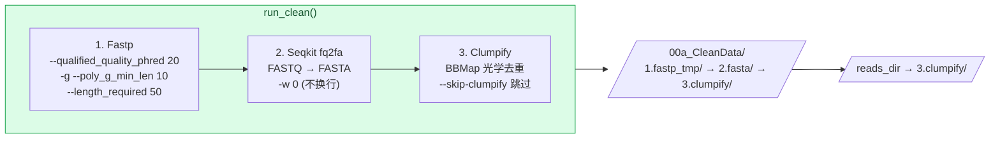

### 4.2 Deplete 阶段

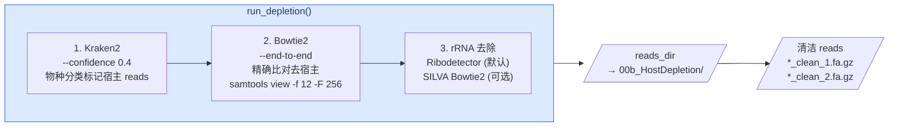

### 4.3 Assembly 阶段

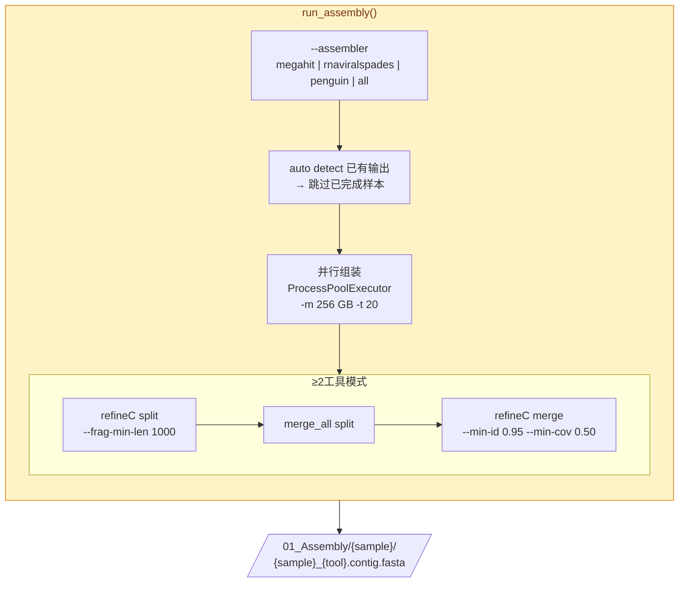

### 4.4 Identification 阶段

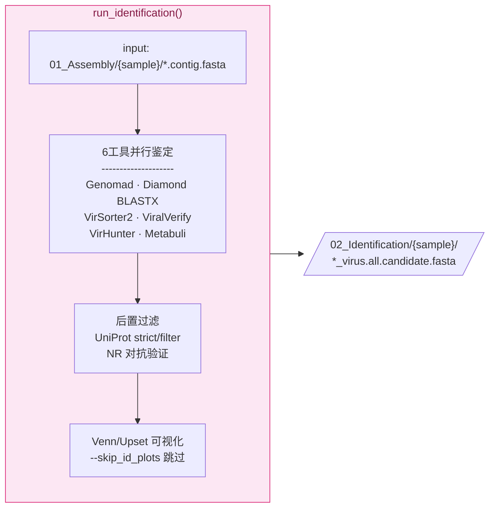

### 4.5 COBRA 阶段

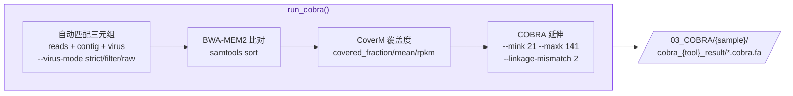

### 4.6 Cluster 阶段

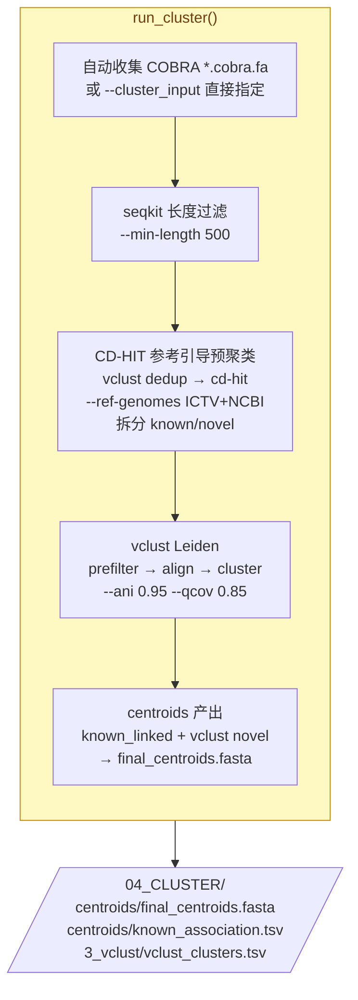

### 4.7 Rescue 阶段 (三支路级联)

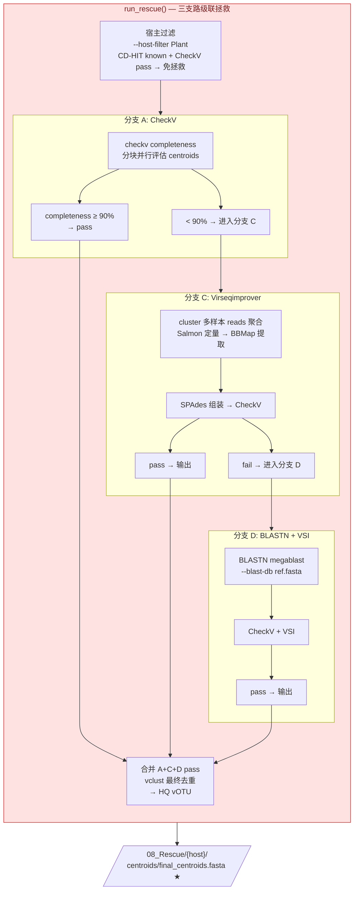

---

## 五、auto_known_virus.py 全架构总览

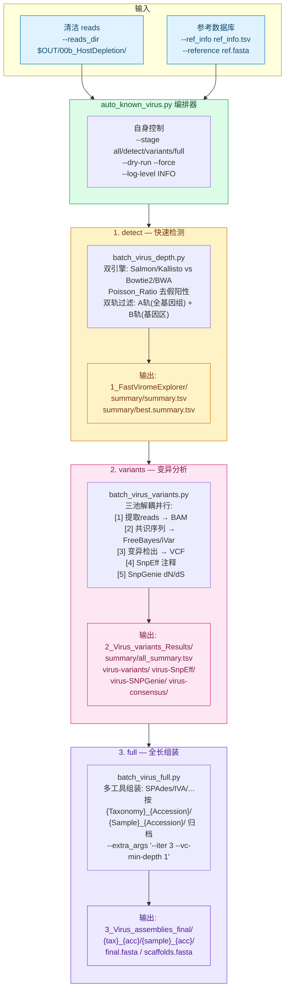

---

## 六、auto_known_virus.py 参数传递关系

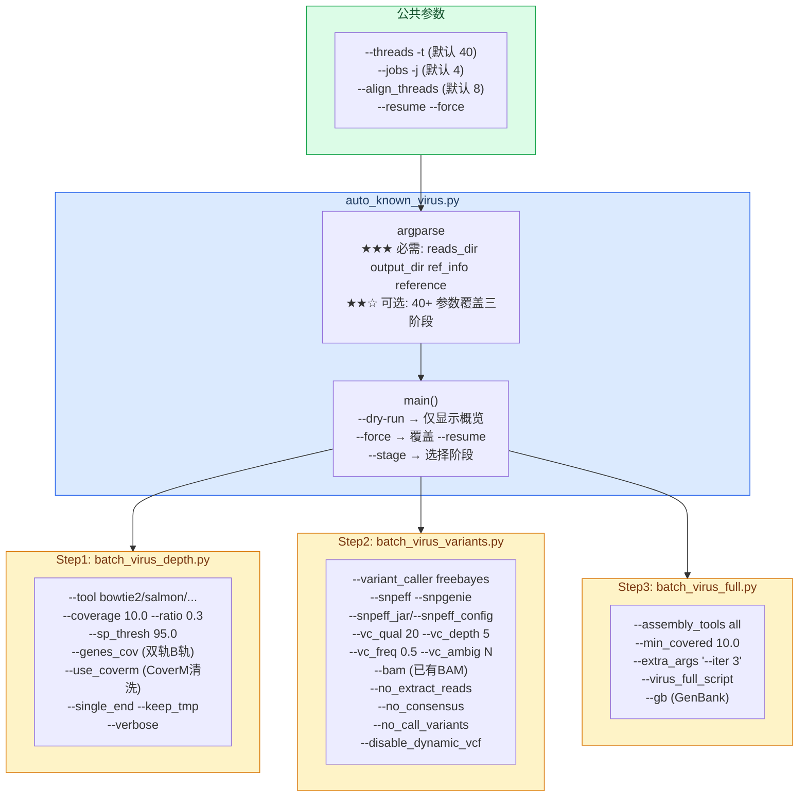

---

## 七、两脚本对比总览

```mermaid
mindmap
    accTitle: MMPV-RNA 双流水线对比
    accDescr: virome_pipeline.py 10阶段新病毒发现 vs auto_known_virus.py 3阶段已知病毒分析

    MMPV-RNA_v2.3
        virome_pipeline.py[新病毒发现]
            预处理
                Clean::icon(fa fa-broom)
                Deplete::icon(fa fa-filter)
            核心
                Assembly::icon(fa fa-cogs)
                Identification::icon(fa fa-search)
                COBRA::icon(fa fa-arrow-right)
                Cluster::icon(fa fa-project-diagram)
            后处理
                Taxonomy::icon(fa fa-tags)
                Host::icon(fa fa-leaf)
                CheckV::icon(fa fa-check-circle)
                Rescue::icon(fa fa-life-ring)
            产出
                新种/新属/新科
                HQ_vOTU
        auto_known_virus.py[已知病毒分析]
            检测
                detect::icon(fa fa-magnifying-glass)
                双引擎+Poisson打假
            变异
                variants::icon(fa fa-dna)
                SnpEff+SnpGenie
            组装
                full::icon(fa fa-puzzle-piece)
                多工具全长组装
            产出
                定量丰度表
                变异谱/dNdS
                全长基因组
```

---

## 八、Rescue 三支路详细序列

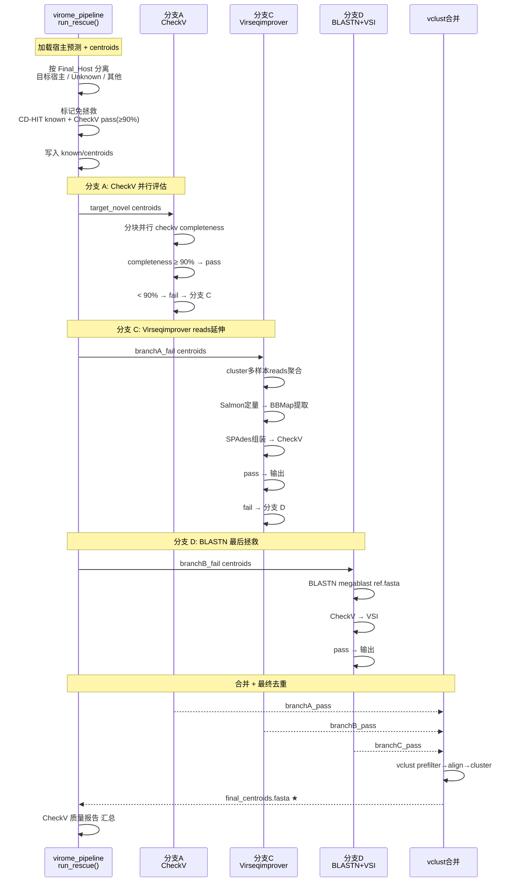

---

*文档生成时间: 2026-06-14 | MMPV-RNA v2.3*
