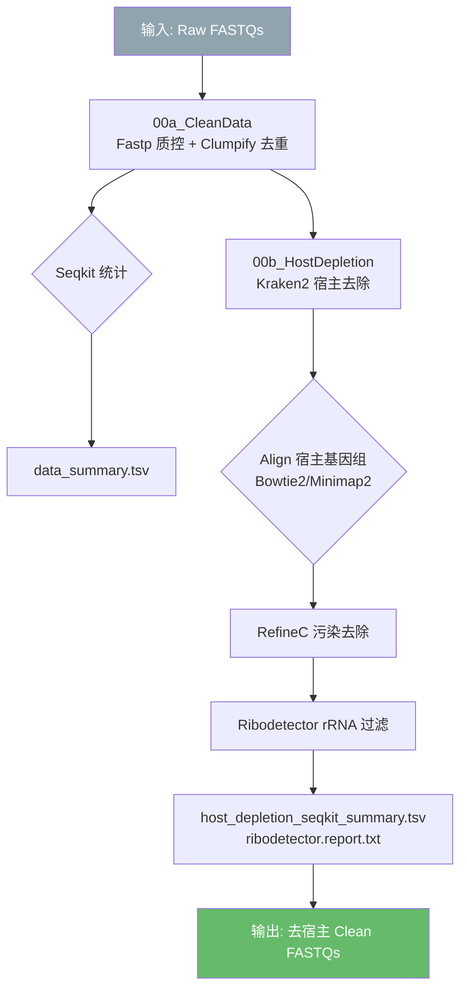
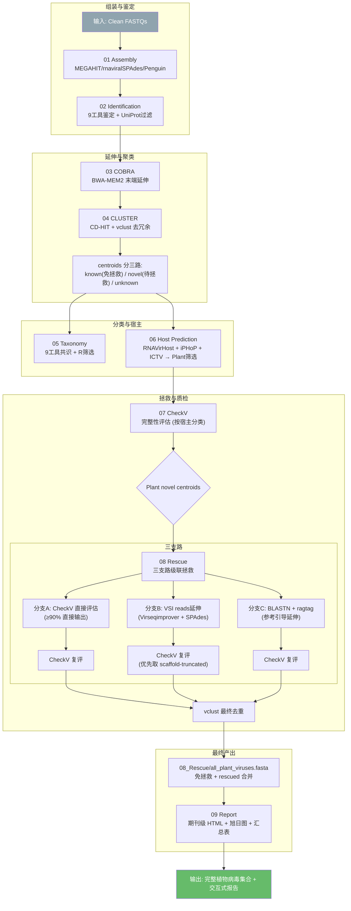
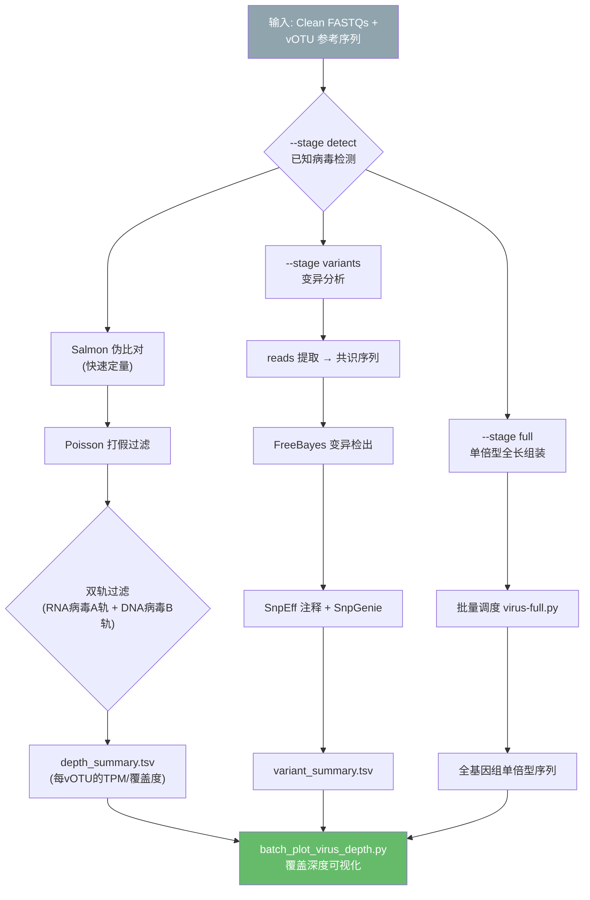
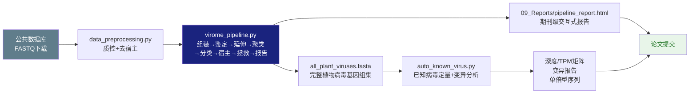

# MMPV-RNA v2.3 流程总览

## 整体关系

```
┌─────────────────────────┐    ┌──────────────────────────────────┐    ┌─────────────────────────┐
│  data_preprocessing.py  │───→│       virome_pipeline.py         │───→│   auto_known_virus.py    │
│  (公共数据预处理)         │    │  (宏病毒组端到端发现与拯救)        │    │  (已知病毒定量+变异分析)   │
│                         │    │                                  │    │                         │
│  00a CleanData          │    │  01 Assembly → 02 Identification │    │  Stage 1: detect         │
│  00b HostDepletion      │    │  03 COBRA → 04 CLUSTER           │    │  Stage 2: variants       │
│                         │    │  05 Taxonomy → 06 Host Prediction │    │  Stage 3: full           │
│                         │    │  07 CheckV → 08 Rescue → 09 Plant│    │                         │
└─────────────────────────┘    └──────────────────────────────────┘    └─────────────────────────┘
         ↓                              ↓                                    ↓
    Clean FASTQs              HQ vOTU centroids                      深度/覆盖率/变异报告
```

## 1. data_preprocessing.py — 公共数据预处理

### 流程图



### 运行描述

`data_preprocessing.py` 是独立的数据预处理模块，负责对公共/自产 FASTQ 数据执行质量控制与宿主序列去除。

**输入**: Raw FASTQ 文件（支持 PE/SE, `.fastq.gz` 等格式）

**输出**: 去宿主 Clean FASTQs + 统计报告

**流程**:
1. **00a CleanData** — 首先使用 Fastp 进行碱基质量过滤（去除低质量碱基、接头、过短序列），并用 Clumpify 去除光学/PCR 重复 reads。Seqkit 统计每步的 reads 数和碱基长度，生成 `data_summary.tsv` 汇总表。
2. **00b HostDepletion** — 使用 Kraken2 快速标记宿主 reads，然后通过 Bowtie2/Minimap2 严格比对宿主参考基因组，RefineC 进一步去除边缘污染，最后 Ribodetector 过滤 rRNA 残留。

**运行方式**:
```bash
python data_preprocessing.py -i input_dir/ -o out/ --host_ref host.fa --threads 64
```

**与后续流程的衔接**: 输出的 Clean FASTQs 可直接作为 `virome_pipeline.py` 的 `--input_reads` 输入。

---

## 2. virome_pipeline.py — 宏病毒组端到端发现与拯救

### 流程图



### 运行描述

`virome_pipeline.py` 是 MMPV-RNA 的核心编排器，协调 10 个子脚本完成从原始测序数据到高质量植物病毒基因组的端到端流程。

**输入**: Clean FASTQs（来自 `data_preprocessing.py`）或直接输入 clusters FASTA（从 `--cluster_input` 接续下游阶段）

**输出**: 完整植物病毒基因组集合 + 期刊级交互式 HTML 报告

**流程**:

1. **01 Assembly** — 调用 MEGAHIT/rnaviralSPAdes/Penguin 进行 de novo 组装，生成每个样本的 contig 集合。输出 `assembly_summary.tsv`（N50/N90/contig数等统计）。

2. **02 Identification** — 运行 9 个病毒鉴定工具（geNomad/BLAST/Metabuli/VirSorter2/ViralVerify/VirHunter/VirBot/Viralm/RdRpCatch），取并集后通过 UniProt 过滤去除假阳性。输出每个样本的病毒候选集。鉴定工具已内置蛋白级比对（BLAST diamond/mmseqs），为下游分类提供蛋白质水平的相似度信息。

3. **03 COBRA** — 使用 BWA-MEM2 将 reads 比对到 contig 两端，向外延伸以恢复完整末端。输出延伸后的 contig 序列及延伸率/孤儿末端统计。

4. **04 CLUSTER** — CD-HIT 做参考引导预聚类（known_linked vs known_pure 分离），vclust 基于 ANI+qcov 对 novel 序列聚类去冗余。输出 centroids（簇代表序列）。

5. **05 Taxonomy** — 9 工具并行分类（geNomad/Metabuli/CAT/DIAMOND-LCA/mmseqs/VITAP/ACVirus/vConTACT3/PhaGCN3），R 脚本做共识筛选，输出 `final_integrated_classification.tsv`。分类结果用于判定病毒新颖性（Known/NewSp/NewGe/NewFa）。

6. **06 Host Prediction** — 三个工具（RNAVirHost/PHaBox/iPHoP/ICTV）预测宿主，取 ensemble 共识。按 `Final_Host == "Plant"` 筛选目标宿主类群。

7. **07 CheckV** — 对所有 centroids 按宿主分组运行 CheckV 完整性评估，生成 `checkv_summary.tsv`。

8. **08 Rescue** — 对目标宿主（Plant）的 novel centroids 执行三支路拯救：
   - **分支 A**: CheckV 直接评估，≥90% completeness 的直接输出（免拯救）。
   - **分支 B**: 用 Virseqimprover (VSI) 聚合 cluster 内多样本 reads 进行迭代延伸，优先取 `scaffold-truncated`（截断前完整版）做 CheckV 复评。
   - **分支 C**: BLASTN (dc-megablast) 检索参考基因组，blastdbcmd 提取参考序列，ragtag 做参考引导排列延伸，CheckV 复评。
   - 三支路通过者经 vclust 最终去重后输出。免拯救（CD-HIT known + CheckV pass ≥90%）与 rescued 结果合并为 `all_plant_viruses.fasta`。

9. **09 Report** — 调用独立 `report_pipeline.py` 生成期刊级 HTML 报告，含 KPI 面板、阶段导航、13 个 Chart.js 交互图表、2 个 Plotly Sankey 图、旭日图（Sunburst）、汇总表（plant_virus_summary.tsv）及完整 Data Appendix。

**运行方式**:
```bash
# 完整流程
python virome_pipeline.py --input_reads clean_fastqs/ --output_dir out/ --host-filter Plant

# 单阶段 (支持断点续传)
python virome_pipeline.py --stage rescue --output_dir out/ --checkv_threshold 90

# 直接输入 clusters (下游接续)
python virome_pipeline.py --stage cluster --cluster_input centroids.fa --output_dir out/
```

**与前后流程的衔接**: 
- 输入端: 接收 `data_preprocessing.py` 的 Clean FASTQs，或从 `--cluster_input` 直接接续下游。
- 输出端: `all_plant_viruses.fasta` 可直接作为 `auto_known_virus.py` 的参考输入。

---

## 3. auto_known_virus.py — 已知病毒定量与变异分析

### 流程图



### 运行描述

`auto_known_virus.py` 是已知病毒定量的专用模块，负责评估已发现的植物病毒在原始测序数据中的丰度、覆盖度及群体变异。

**输入**: Clean FASTQs（需为原始 reads，不可为 `data_preprocessing.py` 处理后的） + vOTU 参考序列（通常来自 `virome_pipeline.py` 的 `all_plant_viruses.fasta` 或 centroids）

**输出**: 每 vOTU 的 TPM/深度/覆盖度矩阵 + 群体变异统计

**流程**:

1. **Stage detect** — 使用 Salmon 快速伪比对所有样本 reads 到 vOTU 参考集，计算 TPM（Transcripts Per Million）和期望深度。Poisson 检验打假（区分真实存在 vs 随机比对）。双轨过滤：RNA 病毒走 A 轨（RNA-seq 模式），DNA 病毒走 B 轨（排除），确保 RNA-seq 数据只报告 RNA 病毒。输出 `depth_summary.tsv`，包含 TOTAL 汇总行。

2. **Stage variants** — 从 BAM 提取比对到每个 vOTU 的 reads，构建共识序列。使用 FreeBayes 检出 SNP/INDEL，SnpEff 预测变异功能影响，SnpGenie 计算群体遗传学指标（dN/dS、π、θ）。输出 `variant_summary.tsv`。

3. **Stage full** — 按 vOTU 批量调度 `virus-full.py` 做单倍型全长组装，恢复完整病毒基因组单倍型序列。

4. **结果可视化** — 调用 `analysis/batch_plot_virus_depth.py` 和 `analysis/virus_frequency_plot.R` 生成覆盖深度图和丰度箱线图。

**运行方式**:
```bash
# 仅检测阶段
python auto_known_virus.py --stage detect --ref all_plant_viruses.fasta \
    -i clean_fastqs/ -o out_known/ --threads 64

# 全流程
python auto_known_virus.py --stage all --ref all_plant_viruses.fasta \
    -i clean_fastqs/ -o out_known/ --threads 64
```

**与前后流程的衔接**:
- 输入端: 接收 `virome_pipeline.py` 的 `all_plant_viruses.fasta` 作为参考序列。
- 输出端: 深度矩阵和变异报告可用于下游的群体遗传学分析、病毒流行率评估和公开发表。

---

## 整体数据流


