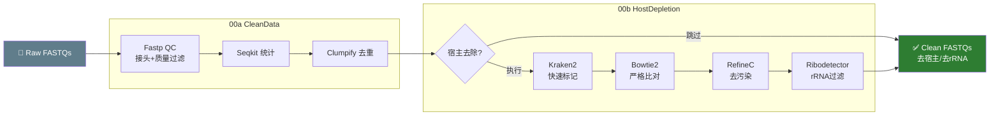
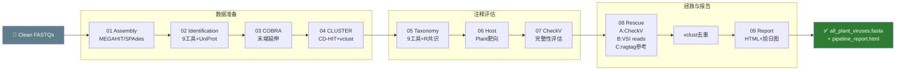
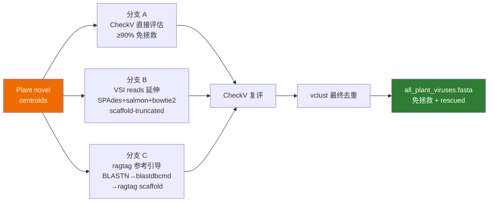
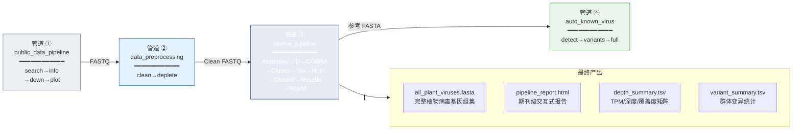

# MMPV-RNA v2.3 四大管道技术路线图

---

## 管道 1: public_data_pipeline.py — 公共数据获取管道


| 阶段 | 脚本 | 功能 |
|------|------|------|
| search | `gsa_sra.search.py` | NGDC GSA + NCBI SRA 双引擎物种检索，DeepSeek AI 辅助生成检索词，合并去重 → `SRA_GSA_Merged_Final.csv` |
| info | `gsa_sra.info.py` | Run 号元数据批量获取 (13 核心字段)，可选 DeepSeek 文献溯源补全 → `Global_Unified_Metadata_Core13.csv` |
| down | `gsa_sra.down.py` | aria2c (NGDC) + prefetch/fasterq-dump (NCBI) 双通道下载，断点续传，并发控制 |
| plot | `gsa_sra.plot.py` | 六张 SCI 级统计图: 平台/地理/时间/组织/来源/类型 → `Combined_Landscape_Full.pdf` |

```bash
python public_data_pipeline.py --species "Lycium barbarum" --taxid 112863 \
    --deepseek-api "sk-xxx" --ncbi-api "xxx" --stage all
```

---

## 管道 2: data_preprocessing.py — 数据预处理管道



| 步骤 | 工具 | 功能 |
|------|------|------|
| Fastp | fastp | 切除 Illumina 接头，Q<15 过滤，<50bp 丢弃，生成 JSON 质检报告 |
| Seqkit | seqkit stats | 统计每步 reads 数和碱基数 |
| Clumpify | clumpify.sh | 去除光学/PCR 重复 reads |
| Kraken2 | kraken2 | 快速分类标记宿主 reads |
| Bowtie2 | bowtie2 | 严格比对宿主参考基因组 |
| RefineC | refineC | 去除比对边界的宿主污染 |
| Ribodetector | ribodetector | 去除残留核糖体 RNA |

```bash
python data_preprocessing.py -i raw_fastqs/ -o out/ --host_ref host.fa --threads 64
```

---

## 管道 3: virome_pipeline.py — 宏病毒组端到端发现管道



### 三支路 Rescue 细节



| 阶段 | 核心功能 |
|------|----------|
| 01 Assembly | MEGAHIT/rnaviralSPAdes/Penguin de novo 组装，输出 N50/N90 统计 |
| 02 Identification | 9 工具并行鉴定 + UniProt 蛋白级过滤 (raw/filter/strict) |
| 03 COBRA | BWA-MEM2 末端延伸，统计延伸率/孤儿率 |
| 04 CLUSTER | CD-HIT 参考预聚类 + vclust (Leiden/ANI) 去冗余 |
| 05 Taxonomy | 9 工具并行分类 (mmseqs/CAT/DIAMOND 等) + R 共识筛选 |
| 06 Host | RNAVirHost + iPHoP + ICTV ensemble 宿主预测 |
| 07 CheckV | 按宿主分组完整性评估 (Complete/High/Medium/Low/NA) |
| 08 Rescue | 三支路拯救 (A: 直接 / B: VSI / C: ragtag), `--checkv_threshold` 可调 |
| 09 Report | 调用独立 `report_pipeline.py` 生成期刊级交互式 HTML |

```bash
python virome_pipeline.py --input_reads clean_fastqs/ --output_dir out/ --host-filter Plant
python virome_pipeline.py --stage rescue --output_dir out/ --checkv_threshold 90
```

---

## 管道 4: auto_known_virus.py — 已知病毒定量与变异管道


| 阶段 | 工具 | 功能 |
|------|------|------|
| detect | Salmon | 伪比对快速定量 → Poisson 检验打假 → 双轨过滤 (RNA-seq 仅保留 RNA 病毒) |
| variants | FreeBayes + SnpEff + SnpGenie | SNP/INDEL 检出 → 功能注释 (同义/错义/移码) → 群体遗传 (dN/dS, π, θ) |
| full | virus-full.py | 批量单倍型全长组装 |

> **注意**: 输入 reads 建议使用仅经 Fastp QC、**未宿主去除**的 reads（宿主去除可能误删病毒 reads）。

```bash
python auto_known_virus.py --stage all --ref all_plant_viruses.fasta \
    -i clean_fastqs/ -o out_known/ --threads 64
```

---

## 四管道整体数据流


