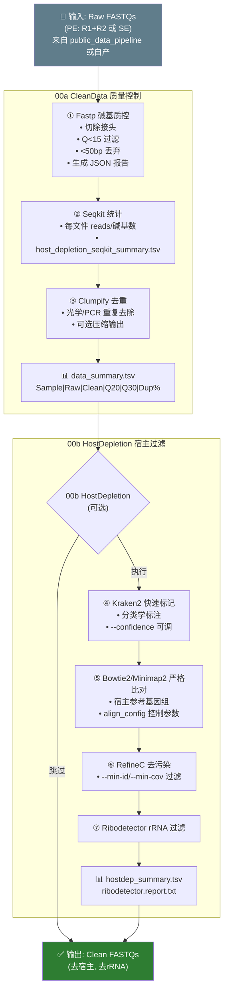
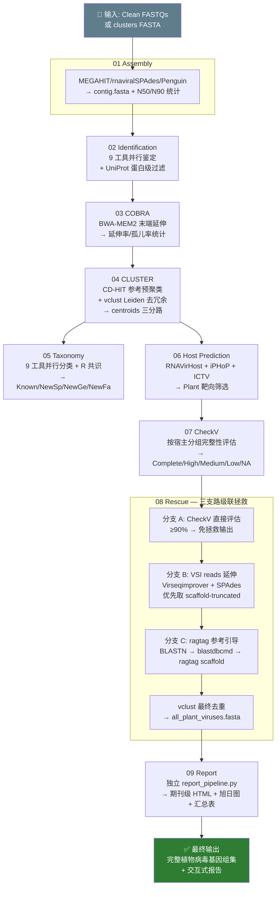
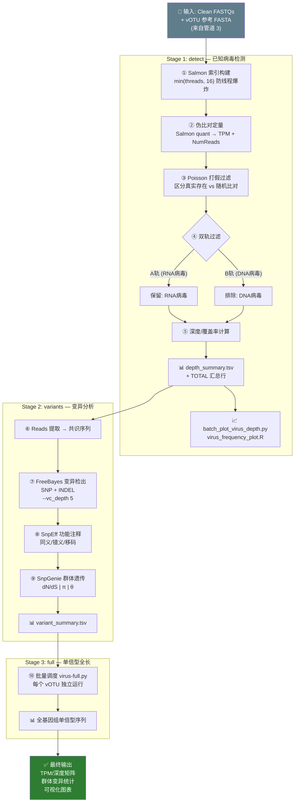

```mermaid
flowchart TD
    A["📂 输入<br/>物种拉丁名 + NCBI TaxID<br/>DeepSeek API + NCBI API"] --> B

    subgraph SEARCH["Stage 1: search — 双引擎检索"]
        B["① GSA 引擎检索<br/>gsa_sra.search.py<br/>• NGDC GSA 数据库<br/>• 物种名 + TaxID 查询<br/>• TRANSCRIPTOMIC 过滤"]
        B1["② SRA 引擎检索<br/>• NCBI SRA 数据库<br/>• DeepSeek AI 辅助检索词<br/>• 物种名+组织+条件组合"]
        B --> B1
        B1 --> B2["③ 结果合并<br/>• GSA + SRA 去重合并<br/>• 自动标注数据来源<br/>• SRA_GSA_Merged_Final.csv"]
    end

    B2 --> C["④ 提取 Run 列表<br/>sra.list"]

    subgraph INFO["Stage 2: info — 元数据深度解析"]
        C --> C1["⑤ 元数据获取<br/>gsa_sra.info.py<br/>• mode: local (仅本地解析)<br/>  / both (AI辅助补全)"]
        C1 --> C2["⑥ 文献溯源<br/>• DeepSeek 自动检索相关论文<br/>• 关联 PubMed/DOI<br/>• --fill-date 补全日期"]
        C2 --> C3["📊 Global_Unified_Metadata_Core13.csv<br/>(13 核心字段统一格式)"]
    end

    C3 --> D["⑦ 生成下载列表<br/>sra.list"]

    subgraph DOWN["Stage 3: down — 高通量数据下载"]
        D --> D1["⑧ NGDC/GSA 下载<br/>gsa_sra.down.py<br/>• aria2c 多线程加速<br/>• --ngdc-concurrency 5<br/>• 断点续传"]
        D1 --> D2["⑨ NCBI/SRA 下载<br/>• prefetch + fasterq-dump<br/>• --prefetch-concurrency 3<br/>• --skip-list 已下载"]
        D2 --> D3["📦 FASTQ 文件<br/>(PE R1+R2 或 SE)"]
    end

    D3 --> E

    subgraph PLOT["Stage 4: plot — SCI 级可视化"]
        E["⑩ 六图综合可视化<br/>gsa_sra.plot.py<br/>• 测序平台分布 (旭日图)<br/>• 地理来源分布 (世界地图)<br/>• 时间趋势 (折线图)<br/>• 组织/器官分布 (柱状图)<br/>• 数据来源比例 (饼图)<br/>• 样本类型统计 (堆叠柱状图)"]
        E --> E1["📊 Combined_Landscape_Full.pdf<br/>(SCI 级多面板组合图)"]
    end

    E1 --> OUT1["✅ 输出<br/>FASTQ 文件 + 元数据表 + SCI 可视化"]

    style A fill:#607d8b,color:#fff
    style OUT1 fill:#2e7d32,color:#fff
```

# MMPV-RNA v2.3 四大管道技术路线图

---

## 管道 1: public_data_pipeline.py — 公共数据获取管道

### 流程图



### 运行描述

`public_data_pipeline.py` 是公共数据获取的端到端管道，负责从 NCBI SRA 和 NGDC GSA 两大公共数据库中检索、下载、组织目标物种的转录组测序数据。

**核心功能**:

1. **search (双引擎检索)**: 并行调用 GSA 和 SRA 检索接口，利用物种拉丁学名、NCBI TaxID 和 DeepSeek AI 生成的多维度检索关键词，自动合并去重两份结果，输出 `SRA_GSA_Merged_Final.csv`。

2. **info (元数据深度解析)**: 对每个 Run 号获取详细的样本元数据（组织、处理条件、测序平台、文库策略等），可选启用 DeepSeek AI 辅助文献溯源和数据补全，最终统一为 `Global_Unified_Metadata_Core13.csv`（13 个核心字段）。

3. **down (高通量下载)**: 区分 NGDC (aria2c 多线程) 和 NCBI (prefetch + fasterq-dump) 两种下载方式，支持断点续传和跳过列表，可同时设置并发数。注意：下载阶段可能耗时数小时至数天。

4. **plot (SCI 级可视化)**: 基于合并元数据自动生成六张高质量统计图表（多面板组合 PDF），包括地理位置、时间趋势、组织分布、平台分布等维度，可直接用于论文发表。

**运行方式**:
```bash
python public_data_pipeline.py --species "Lycium barbarum" --taxid 112863 \
    --deepseek-api "sk-xxx" --ncbi-api "xxx" --stage all
```

**与后续管道的衔接**: 输出的 FASTQ 文件直接作为 `data_preprocessing.py` 的输入，进行质量控制与宿主去除。

---

## 管道 2: data_preprocessing.py — 数据预处理管道

### 流程图



### 运行描述

`data_preprocessing.py` 是独立的数据预处理模块，对管道 1 产出的 Raw FASTQ 数据执行标准化质控和宿主序列去除。

**核心流程**: Fastp 接头/质量过滤 → Seqkit 统计 → Clumpify 去重 → Kraken2 宿主标记 → Bowtie2/Minimap2 严格比对 → RefineC 边缘去污染 → Ribodetector rRNA 过滤。

每步产出统计报告，确保数据质量可追溯。

**运行方式**:
```bash
python data_preprocessing.py -i raw_fastqs/ -o out/ --host_ref host.fa --threads 64
```

**与后续管道的衔接**: 输出的 Clean FASTQs 直接作为 `virome_pipeline.py --input_reads` 的输入。

---

## 管道 3: virome_pipeline.py — 宏病毒组端到端发现管道

### 流程图



### 运行描述

`virome_pipeline.py` 是 MMPV-RNA 的核心编排器，协调 11 个阶段实现从 Clean reads 到高质量植物病毒基因组集的端到端流程。

**核心九阶段**: Assembly → Identification (9 工具蛋白级鉴定) → COBRA 末端延伸 → CLUSTER 去冗余 → Taxonomy 多工具共识分类 → Host Prediction 宿主预测 (Plant 靶向) → CheckV 完整性评估 → Rescue 三支路级联拯救 (A: 直接评估 / B: VSI reads 延伸 / C: ragtag 参考引导) → Report 报告生成。

**关键设计**: 参数贯穿所有子脚本；断点续传；单阶段可独立运行；多宿主靶向支持；`--checkv_threshold` 可调。

**运行方式**:
```bash
# 完整流程
python virome_pipeline.py --input_reads clean_fastqs/ --output_dir out/ --host-filter Plant

# 单阶段
python virome_pipeline.py --stage rescue --output_dir out/ --checkv_threshold 90
```

**与前后管道的衔接**:
- 输入: 管道 2 的 Clean FASTQs
- 输出: `all_plant_viruses.fasta` → 管道 4 的参考序列

---

## 管道 4: auto_known_virus.py — 已知病毒定量与变异管道

### 流程图



### 运行描述

`auto_known_virus.py` 是已知病毒定量与变异分析的专业模块，评估已发现的植物病毒在各样本中的丰度、覆盖度和群体变异特征。

**核心功能**:
1. **detect (检测)**: Salmon 伪比对快速定量 → Poisson 检验打假 → 双轨过滤 (RNA-seq 仅保留 RNA 病毒) → `depth_summary.tsv` + 可视化图表。
2. **variants (变异)**: FreeBayes + SnpEff + SnpGenie 三级变异分析，涵盖 SNP/INDEL 检出、功能注释和群体遗传参数。
3. **full (单倍型)**: 批量调度 virus-full.py 做全基因组单倍型组装。

**注意**: 输入 reads 建议使用**仅经 Fastp QC、未宿主去除**的 reads（宿主去除可能误删与宿主相似的病毒 reads）。

**运行方式**:
```bash
python auto_known_virus.py --stage all --ref all_plant_viruses.fasta \
    -i clean_fastqs/ -o out_known/ --threads 64
```

**与前后管道的衔接**: 输入参考来自管道 3 的 `all_plant_viruses.fasta`，输出矩阵/变异数据可直接用于论文发表。

---

## 四管道整体数据流


### 数据衔接关系

| 管道 | 脚本 | 阶段 | 输入 ← | → 输出 |
|------|------|------|--------|--------|
| ① | `public_data_pipeline.py` | search→info→down→plot | 物种名 + TaxID | FASTQs + 元数据 |
| ② | `data_preprocessing.py` | clean→deplete | ← ① FASTQs | Clean FASTQs → |
| ③ | `virome_pipeline.py` | 01→...→09 | ← ② Clean FASTQs | all_plant_viruses.fasta → |
| ④ | `auto_known_virus.py` | detect→variants→full | ← ③ 参考 FASTA | 深度/变异矩阵 |

### 各管道独立运行方式

```bash
# 管道 1: 公共数据获取
python public_data_pipeline.py --species "Lycium barbarum" --taxid 112863 \
    --deepseek-api "sk-xxx" --ncbi-api "xxx" --stage all

# 管道 2: 数据预处理
python data_preprocessing.py -i raw_fastqs/ -o out/ --host_ref host.fa --threads 64

# 管道 3: 病毒发现 + 拯救 + 报告
python virome_pipeline.py --input_reads clean_fastqs/ --output_dir out/ --host-filter Plant

# 管道 4: 已知病毒定量 + 变异
python auto_known_virus.py --stage all --ref all_plant_viruses.fasta \
    -i clean_fastqs/ -o out_known/ --threads 64
```
