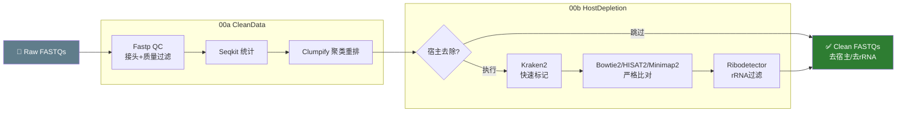
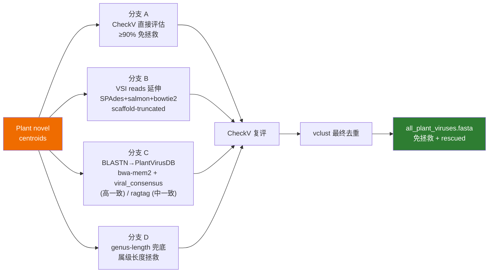
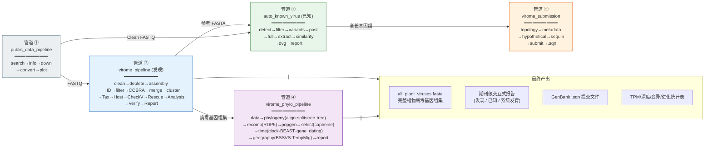

# MMPV v3.0 六大管线技术路线图

> 目录结构（2026-09-22，二次整合）：数据预处理归并为两条顶层管线——
> `public_metadata_pipeline/`（数据获取：测序数据检索/下载/转换 ＋ 宿主参考基因组获取/建库）与
> `data_preprocessing_pipeline/`（数据清洗：质控 clean-data.py → 去宿主 host_depletion.py；
> 本文"管道 2"的组合入口 data_preprocessing.py / preprocess.py 位于该目录）。管道编号沿用历史口径。

---

## 管道 1: public_data_pipeline.py — 公共数据获取管道


```mermaid
flowchart LR
    A["📂 物种+TaxID"] --> B["search<br/>GSA+SRA 双引擎检索"]
    B --> C["info<br/>元数据深度解析<br/>+ 文献溯源"]
    C --> D["down<br/>aria2c/prefetch<br/>高通量下载"]
    D --> E["convert<br/>fasterq-dump<br/>SRA→FASTQ.GZ"]
    E --> F["plot<br/>SCI 六图可视化"]
    F --> G["✅ FASTQs<br/>+ 元数据表<br/>+ PDF 图表"]

    style A fill:#607d8b,color:#fff
    style G fill:#2e7d32,color:#fff
```

| 阶段 | 脚本 | 功能 |
|------|------|------|
| search | `gsa_sra.search.py` | NGDC GSA + NCBI SRA 双引擎物种检索，DeepSeek AI 辅助生成检索词，合并去重 → `SRA_GSA_Merged_Final.csv` |
| info | `gsa_sra.info.py` | Run 号元数据批量获取 (14 核心字段)，可选 DeepSeek 文献溯源补全 → `Global_Unified_Metadata_Core14.csv` |
| down | `gsa_sra.down.py` | aria2c (NGDC) + prefetch (NCBI) 双通道下载，断点续传，并发控制 |
| convert | `sra2fastx.py` | fasterq-dump 批量 SRA → FASTQ.GZ（失败回退 fastq-dump） |
| plot | `gsa_sra.plot.py` | 六张 SCI 级统计图: 平台/地理/时间/组织/来源/类型 → `Combined_Landscape_Full.pdf` |
| report | `generate_report.py` | 交互式 HTML 报告 + `sample_handoff.csv` 交接清单（Run→FASTQ 绝对路径+Core14 元数据, 交棒管道 2） |
| hostref | `download_host_genome.py` | 宿主基因组下载（四通道 datasets/ngd/FTP/gget · `--host-fasta` 用户基因组跳过下载） |
| hostdb | `build_hostbase.py` | 宿主四索引构建（Kraken2/Bowtie2/HISAT2/Minimap2）→ `host_reference/hostdb/`（默认复用 --species/--taxid） |

```bash
python public_data_pipeline.py --species "Lycium barbarum" --taxid 112863 \
    --deepseek-api "sk-xxx" --ncbi-api "xxx" --stage all
```

---

## 管道 2: data_preprocessing.py — 数据预处理管道（质控 + 去宿主组合入口）


```mermaid
flowchart LR
    A["📂 Raw FASTQs"] --> B

    subgraph S1["00a CleanData"]
        direction LR
        B["Fastp QC<br/>接头+质量过滤"] --> C["Seqkit 统计"] --> D["Clumpify 聚类重排"]
    end

    D --> E{"宿主去除?"}

    subgraph S2["00b HostDepletion"]
        direction LR
        E -->|执行| F["Kraken2<br/>快速标记"] --> G["Bowtie2/HISAT2/Minimap2<br/>严格比对"] --> I["Ribodetector<br/>rRNA过滤"]
    end

    E -->|跳过| J
    I --> J["✅ Clean FASTQs<br/>去宿主/去rRNA"]

    style A fill:#607d8b,color:#fff
    style J fill:#2e7d32,color:#fff
```

| 步骤 | 工具 | 功能 |
|------|------|------|
| Fastp | fastp | 切除 Illumina 接头，Q<15 过滤，<50bp 丢弃，生成 JSON 质检报告 |
| Seqkit | seqkit stats | 统计每步 reads 数和碱基数 |
| Clumpify | clumpify.sh | 去除光学/PCR 重复 reads |
| Kraken2 | kraken2 | 快速分类标记宿主 reads |
| Bowtie2/HISAT2/Minimap2 | bowtie2 等 | 严格比对宿主参考基因组 |
| Ribodetector | ribodetector | 去除残留核糖体 RNA |

```bash
python data_preprocessing_pipeline/data_preprocessing.py -i raw_fastqs/ -o out/ --host_ref host.fa --threads 64
```

`--stage all` 末尾自动运行 report 阶段（`preprocess_report.py`，纯解析上游统计文件）：产出
`preprocessing_summary.tsv`（每样本 Raw→Fastp→Kraken2→去宿主→去rRNA 留存率+状态）、
`assembly_ready.list`（最终 reads 绝对路径 → 管道 3 的 `--input_reads` 交接清单）、
`preprocessing_report.html`（留存率图，离线可用）。

---

## 管道 3: virome_pipeline.py — 宏病毒组端到端发现管道


```mermaid
flowchart LR
    A["📂 Clean FASTQs"] --> B

    subgraph G1["数据准备"]
        direction LR
        B["01 Assembly<br/>MEGAHIT/SPAdes/Penguin"] --> C["02a Identification<br/>10工具"] --> C2["02b Filter<br/>UniRef90+CDD"] --> D["03a COBRA<br/>末端延伸"] --> D2["03b Merge<br/>+Flye共组装"] --> E["04 CLUSTER<br/>CD-HIT+vclust"]
    end

    E --> F

    subgraph G2["注释评估"]
        direction LR
        F["05 Taxonomy<br/>8工具+R共识"] --> G["06 Host<br/>Plant靶向"] --> H["07 CheckV<br/>完整性评估"]
    end

    H --> I

    subgraph G3["拯救与报告"]
        direction LR
        I["08 Rescue<br/>A:CheckV≥90%<br/>B:VSI reads<br/>C:参考重建<br/>D:属长兜底"] --> J["vclust去重"] --> K["09 Report<br/>HTML+Sankey"]
    end

    K --> L["✅ all_plant_viruses.fasta<br/>+ pipeline_report.html"]

    style A fill:#607d8b,color:#fff
    style L fill:#2e7d32,color:#fff
```

### 四支路 Rescue 细节


```mermaid
flowchart LR
    A["Plant novel<br/>centroids"] --> B["分支 A<br/>CheckV 直接评估<br/>≥90% 免拯救"]
    A --> C["分支 B<br/>VSI reads 延伸<br/>SPAdes+salmon+bowtie2<br/>scaffold-truncated"]
    A --> D["分支 C<br/>BLASTN→PlantVirusDB<br/>bwa-mem2 + viral_consensus<br/>(高一致) / ragtag (中一致)"]
    A --> H["分支 D<br/>genus-length 兜底<br/>属级长度拯救"]
    B --> E["CheckV 复评"]
    C --> E
    D --> E
    H --> E
    E --> F["vclust 最终去重"]
    F --> G["all_plant_viruses.fasta<br/>免拯救 + rescued"]

    style A fill:#ef6c00,color:#fff
    style G fill:#2e7d32,color:#fff
```

| 阶段 | 核心功能 |
|------|----------|
| 01 Assembly | MEGAHIT/rnaviralSPAdes/Penguin de novo 组装，输出 N50/N90 统计 |
| 02 Identification | 10 工具并行鉴定 (Genomad+Diamond BLASTX+RdrpCatch+ViraLM+VirBot+VirSorter2+ViralVerify+VirHunter+Metabuli+Viroid BLASTN) + UniProt 蛋白级过滤 |
| 03 COBRA | BWA-MEM2 末端延伸，统计延伸率/孤儿率 |
| 04 CLUSTER | CD-HIT 参考预聚类 + vclust (Leiden/ANI) 去冗余 |
| 05 Taxonomy | 8 工具并行分类 + 加权投票共识 (8级 taxonomy) |
| 06 Host | ICTV > RNAVirHost > PhaBOX2 三级宿主预测 + 植物专属后过滤 |
| 07 CheckV | 按宿主分组完整性评估 (Complete/High/Medium/Low/NA) |
| 08 Rescue | 四支路拯救 (A: CheckV直接 / B: VSI / C: BLASTN→PlantVirusDB 重建 / D: genus-length 兜底), `--checkv_threshold` 可调 |
| 09 Report | 调用独立 `report_pipeline.py` 生成期刊级交互式 HTML |

```bash
python virome_pipeline.py --input_reads clean_fastqs/ --output_dir out/ --host-filter Plant
python virome_pipeline.py --stage rescue --output_dir out/ --checkv_threshold 90
```

---

## 管道 4: auto_known_virus.py — 已知病毒分析管道 (9 阶段)


```mermaid
flowchart LR
    A["📂 FASTQs<br/>+ vOTU参考"] --> B

    subgraph S1["detect 检测"]
        direction LR
        B["Salmon<br/>索引"] --> C["伪比对<br/>TPM定量"] --> D["Poisson<br/>打假"] --> E["双轨<br/>过滤"] --> F["depth_summary.tsv"]
    end

    F --> G["filter<br/>高置信过滤"] --> H

    subgraph S2["variants 变异"]
        direction LR
        H["Reads<br/>提取"] --> I["共识<br/>序列"] --> J["FreeBayes·iVar·LoFreq<br/>SNP/INDEL"] --> M["variant_summary.tsv"]
    end

    M --> N

    subgraph S2b["post 变异后处理"]
        direction LR
        N["virus_vcf_pipeline<br/>VCF可视化 + SnpEff宏<br/>+ MAF瀑布 + SnpGenie dN/dS"]
    end

    N --> N2

    subgraph S3["full 全长基因组构建"]
        direction LR
        N2["OmniVirusAssembler<br/>(virus-full.py V9.0)"] --> O["SHIVER-like融合骨架<br/>→ Reads级迭代抛光<br/>→ 双引擎补洞 → 环化"]
    end

    O --> P["extract<br/>N-fill 提取"] --> R["similarity<br/>SDT"] --> S["dvg<br/>ViReMa"] --> T["✅ HTML报告<br/>+ AI解读"]

    style A fill:#607d8b,color:#fff
    style T fill:#2e7d32,color:#fff
```

| 阶段 | 工具 | 功能 |
|------|------|------|
| detect | Salmon/Kallisto/Bowtie2 | 多引擎快速定量 → Poisson 检验打假 → 双轨过滤 (RNA-seq 仅保留 RNA 病毒) |
| filter | filter_summary.py | 高置信度过表过滤 |
| variants | FreeBayes/iVar/LoFreq | SNP/INDEL 检出 + 共识序列构建 |
| post | virus_vcf_pipeline.py | VCF 可视化 + SnpEff 注释 (同义/错义/移码) + MAF 瀑布 + SnpGenie 群体遗传 (dN/dS, π, θ) |
| full | OmniVirusAssembler (virus-full.py V9.0) | **全长基因组构建**: 12步精炼 — SHIVER-like Divine Fusion 实心骨架 → Reads级迭代抛光 (单碱基精度) → gmcloser + abyss-sealer 双引擎补洞 → 环化检测 (Circular=True) |
| extract | extract_full_fasta.py | 最长 contig 提取 + 参考 N-fill (RNA: N<5% 才填) |
| similarity | virus_auto_pipeline.py | 全长相似性热图 + 层次聚类 (MAFFT --auto) |
| dvg | batch_virema_dvg.py | ViReMa DVG/重组检测 + Circos 图 |
| report | generate_pipeline_report.py | 交互式 HTML 综合报告 + AI 解读提示词 |

> **注意**: 输入 reads 建议使用仅经 Fastp QC、**未宿主去除**的 reads（宿主去除可能误删病毒 reads）。
> 正选择分析 (`capheine` / HyPhy) 已迁移至 `virome_phylo_pipeline/`。

```bash
python auto_known_virus.py --stage all --ref all_plant_viruses.fasta \
    -i clean_fastqs/ -o out_known/ --threads 64
```

---

## 管线整体数据流


```mermaid
flowchart LR
    P1["管道 ①<br/>public_data_pipeline<br/>━━━━━━━━━━━━<br/>search→info→down<br/>→convert→plot"] -->|"FASTQ"| P2["管道 ②<br/>virome_pipeline (发现)<br/>━━━━━━━━━━━━<br/>clean→deplete→assembly<br/>→ID→filter→COBRA→merge→cluster<br/>→Tax→Host→CheckV→Rescue→Analysis<br/>→Verify→Report"]

    P2 -->|"参考 FASTA"| P3["管道 ③<br/>auto_known_virus (已知)<br/>━━━━━━━━━━━━<br/>detect→filter→variants→post<br/>→full→extract→similarity<br/>→dvg→report"]
    P1 -->|"Clean FASTQ"| P3
    P2 -->|"病毒基因组集"| P4["管道 ④<br/>virome_phylo_pipeline<br/>━━━━━━━━━━━━<br/>data→phylogeny(align·splitstree·tree)<br/>→recomb(RDP5)→popgen→select(capheine)<br/>→time(clock·BEAST·gene_dating)<br/>→geography(BSSVS·TempMig)→report"]
    P3 -->|"全长基因组"| P5["管道 ⑤<br/>virome_submission<br/>━━━━━━━━━━━━<br/>topology→metadata<br/>→hypothetical→sequin<br/>→submit→.sqn"]

    P2 -->|"|"| OUT
    P4 -->|"|"| OUT

    subgraph OUT["最终产出"]
        direction TB
        O1["all_plant_viruses.fasta<br/>完整植物病毒基因组集"]
        O2["期刊级交互式报告<br/>(发现 / 已知 / 系统发育)"]
        O3["GenBank .sqn 提交文件"]
        O4["TPM/深度/变异/进化统计表"]
    end

    style P1 fill:#eceff1,stroke:#607d8b,color:#333
    style P2 fill:#e3f2fd,stroke:#1565c0,color:#333
    style P3 fill:#e8f5e9,stroke:#2e7d32,color:#333
    style P4 fill:#f3e5f5,stroke:#6a1b9a,color:#333
    style P5 fill:#fff3e0,stroke:#e65100,color:#333
```
