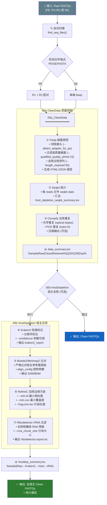
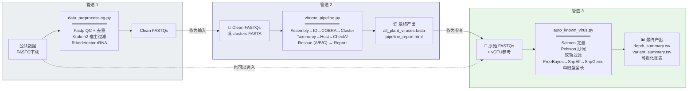

# MMPV-RNA v2.3 三大管道技术路线图

---

## 1. data_preprocessing.py — 公共数据预处理管道

### 运行描述

`data_preprocessing.py` 是独立的数据预处理模块，负责对公共数据库下载或自产的原始 FASTQ 数据执行标准化的质量控制与宿主序列去除。

**核心功能**:
1. **自动文件扫描**: 递归查找输入目录中所有测序文件（支持 `.fastq.gz`, `.fq.gz`, `.fa.gz` 等格式），自动识别 PE/SE 配对。
2. **碱基质控 (Fastp)**: 切除 Illumina 接头，去除低质量碱基（Q < 15），过滤过短 reads（< 50bp），统计重复率并生成 JSON 质检报告。
3. **宿主去除**: Kraken2 快速分类标记宿主 reads → Bowtie2/Minimap2 严格比对宿主参考 → RefineC 去除边缘污染 → Ribodetector 过滤 rRNA 残留，五步级联确保宿主去除彻底性。
4. **统计输出**: 每步骤通过 Seqkit 统计 reads 数和碱基数，生成 `data_summary.tsv`（QC 前后对比）和 `hostdep_summary.tsv`（各过滤步骤的保留/去除 reads 数）。

**与主管道的衔接**: 输出的 Clean FASTQs 直接作为 `virome_pipeline.py --input_reads` 的输入。

---

## 2. virome_pipeline.py — 宏病毒组端到端发现管道

```mermaid
flowchart TD
    A["📂 输入<br/>Clean FASTQs<br/>或 clusters FASTA"] --> B

    subgraph ASSEMBLY["01 Assembly 组装"]
        B["① 选择组装器<br/>--assembler megahit<br/>   /rnaviralspades/penguin/all"]
        B --> B1["② de novo 组装<br/>• MEGAHIT: 大样本宏基因组<br/>• rnaviralSPAdes: RNA 病毒特化<br/>• Penguin: 多 kmer 迭代"]
        B1 --> B2["③ 统计输出<br/>• assembly_summary.tsv (N50/N90/contig/大小)<br/>• 每样本 .contig.fasta"]
    end

    B2 --> C

    subgraph IDENT["02 Identification 鉴定"]
        C["④ 9 工具并行鉴定<br/>genomad/BLAST/metabuli/<br/>virsorter2/viralverify/virhunter/<br/>virbot/viralm/rdrpcatch"]
        C --> C1["⑤ 取并集<br/>*.virus.all.candidate.fasta"]
        C1 --> C2["⑥ UniProt 过滤<br/>• raw/filter/strict 三级过滤<br/>• --virus_mode 控制严格度<br/>• --virus_protein_db 参考库<br/>• 蛋白级 BLAST 比对 (blast_output/*.vp.txt)"]
        C2 --> C3["📊 ident_summary.tsv<br/>filter_summary.tsv<br/>tool_overlap.tsv"]
    end

    C3 --> D

    subgraph COBRA["03 COBRA 延伸"]
        D["⑦ BWA-MEM2 末端延伸<br/>• --cobra_mink/--cobra_maxk<br/>• 多 kmer 迭代延伸"]
        D --> D1["⑧ 延伸统计<br/>• 环化/部分延伸/失败/孤儿末端<br/>• cobra_summary.tsv<br/>• cobra_contig_detail.tsv"]
    end

    D1 --> E

    subgraph CLUSTER["04 CLUSTER 聚类"]
        E["⑨ CD-HIT 参考预聚类<br/>• --cdhit_ani/--cdhit_qcov<br/>• known_linked (有关联contig)<br/>• known_pure (纯参考, 不进下游)"]
        E --> E1["⑩ vclust 去冗余<br/>• prefilter → align → cluster<br/>• Leiden 算法 / ANI+qcov"]
        E1 --> E2["📊 centroids 三分路<br/>① known (免拯救)<br/>② novel (待拯救)<br/>③ unknown"]
    end

    E2 --> F
    E2 --> G

    subgraph TAX["05 Taxonomy 分类"]
        F["⑪ 9 工具并行分类<br/>genomad/metabuli/CAT/<br/>diamond_lca/mmseqs/VITAP/<br/>ACVirus/vcontact3/PhaGCN3"]
        F --> F1["⑫ R 共识筛选<br/>• consistency_summary.tsv<br/>• agreement_stats.tsv<br/>• final_integrated_classification.tsv"]
        F1 --> F2["⑬ Novelty 判定<br/>Known|NewSp|NewGe|NewFa"]
    end

    subgraph HOST["06 Host 宿主预测"]
        G["⑭ RNAVirHost + iPHoP + ICTV<br/>• 三步 ensemble 预测<br/>• --skip-rnavirhost/--skip-phabox/--skip-ictv"]
        G --> G1["⑮ Plant 靶向筛选<br/>• Final_Host == Plant<br/>• decision_method 记录<br/>• ensemble_host_summary.tsv"]
    end

    G1 --> H

    subgraph CHECKV["07 CheckV 完整性评估"]
        H["⑯ 按宿主分组 CheckV<br/>• checkv completeness<br/>• aai_completeness/confidence<br/>• --checkv_db 参考库"]
        H --> H1["📊 checkv_summary.tsv<br/>checkv_confidence.tsv<br/>(Complete/High/Medium/Low/NA)"]
    end

    H1 --> I

    subgraph RESCUE["08 Rescue 三支路拯救 (Plant target)"]
        I["⑰ 分支 A: CheckV 直接评估<br/>aai_completeness ≥90% → 免拯救输出"]
        
        I --> I1["⑱ 分支 B: VSI reads 延伸<br/>• Virseqimprover 迭代扩展<br/>• SPAdes + salmon 0.8.1 + bowtie2<br/>• cluster 内多样本 reads 聚合<br/>• --max_vsi_samples (默认10)<br/>• --min_vsi_len (默认2000bp)<br/>• 优先取 scaffold-truncated<br/>• CheckV 自动停止 (NA→退出)"]
        
        I1 --> I2["⑲ 分支 C: ragtag 参考引导<br/>• BLASTN dc-megablast 检索参考<br/>• blastdbcmd 提取参考序列<br/>• ragtag scaffold 参考引导排列延伸<br/>• CheckV 复评"]
        
        I2 --> I3["⑳ vclust 最终去重<br/>三支路通过者合并去冗余"]
        
        I3 --> I4["📦 完整植物病毒集合<br/>all_plant_viruses.fasta<br/>(免拯救 + rescued 合并)<br/>三分类: CD-HIT known | CheckV pass | rescued"]
    end

    I4 --> J

    subgraph REPORT["09 Report 报告生成"]
        J["㉑ 调用 report_pipeline.py<br/>独立报告生成器"]
        J --> J1["📊 产出<br/>• pipeline_report.html<br/>  (KPI+13图表+桑基图+旭日图)<br/>• stage_summary.tsv<br/>• plant_virus_summary.tsv<br/>• 全部阶段汇总 TSVs"]
    end

    J1 --> OUT["✅ 最终输出<br/>完整植物病毒基因组集<br/>+ 期刊级交互式报告"]

    style A fill:#607d8b,color:#fff
    style OUT fill:#2e7d32,color:#fff
```

### 运行描述

`virome_pipeline.py` 是 MMPV-RNA 的核心编排器，以单一入口串联 11 个阶段（clean→deplete→assembly→identification→cobra→cluster→taxonomy→host→checkv→rescue→report），实现从原始测序数据到期刊级报告的全自动化流程。

**关键设计原则**:
- **参数贯穿**: 所有子脚本参数均通过编排器透传，避免直接修改子脚本。
- **断点续传**: 每个阶段均支持 checkpoint 机制，中断后重跑自动跳过已完成步骤。
- **多宿主靶向**: `--host-filter Plant` 筛选后仅对该类群执行拯救，其余宿主 centroids 记录但跳过。
- **可独立运行**: 任意单阶段可通过 `--stage <name>` 独立执行。下游阶段支持 `--cluster_input` 直接接续。

**核心流程**:
1. **组装→鉴定→延伸→聚类** (01-04): 数据准备阶段，从 reads 到去冗余 centroids。
2. **分类→宿主→CheckV** (05-07): 注释阶段，获取每个 centroid 的分类学信息和完整性评估。
3. **拯救** (08): 三支路级联（CheckV 直接评估 → VSI reads 延伸 → ragtag 参考引导），最大化恢复高质量病毒基因组。Plant 阈值默认 90%（可通过 `--checkv_threshold` 调整）。
4. **报告** (09): 调用独立 `report_pipeline.py` 生成期刊级交互式 HTML 报告，并合并 `known + rescued` 产出完整植物病毒集。

**与前后流程的衔接**:
- 输入: `data_preprocessing.py` 的 Clean FASTQs，或从 `--cluster_input` 直接接续下游。
- 输出: `all_plant_viruses.fasta` 可供 `auto_known_virus.py` 定量分析。

---

## 3. auto_known_virus.py — 已知病毒定量与变异管道

```mermaid
flowchart TD
    A["📂 输入<br/>Clean FASTQs<br/>+ 参考 vOTU FASTA<br/>(来自 virome_pipeline)"]

    A --> B

    subgraph DETECT["Stage 1: detect 已知病毒检测"]
        B["① 参考序列索引<br/>Salmon index<br/>• --salmon-kmer 可调<br/>• 线程数 min(threads,16) 防炸"]
        B --> B1["② 伪比对定量<br/>Salmon quant<br/>• 快速伪比对 (无需全比对)<br/>• TPM + NumReads 输出"]
        B1 --> B2["③ Poisson 打假过滤<br/>• 区分真实病毒存在 vs 随机比对<br/>• p-value 阈值过滤"]
        B2 --> B3{"④ 双轨过滤"}
        B3 -->|"A轨 (RNA病毒)"| B4["保留: RNA病毒<br/>+ 反转录病毒"]
        B3 -->|"B轨 (DNA病毒)"| B5["排除: DNA病毒<br/>(RNA-seq 数据中排除)"]
        B4 --> B6["⑤ 深度/覆盖率计算<br/>• 期望深度<br/>• 覆盖度 (%)<br/>• 覆盖均一度"]
        B5 --> B6
        B6 --> B7["📊 depth_summary.tsv<br/>vOTU|Sample|TPM|Depth|Coverage<br/>+ TOTAL 汇总行"]
        B7 --> B8["📈 可视化<br/>batch_plot_virus_depth.py<br/>virus_frequency_plot.R"]
    end

    B7 --> C
    B8 --> C

    subgraph VARIANTS["Stage 2: variants 变异分析"]
        C{"--stage variants<br/>需 depth_summary.tsv"}
        C --> C1["⑥ Reads 提取<br/>• 从 BAM 提取每个 vOTU 的比对 reads<br/>• 按 vOTU 分文件"]
        C1 --> C2["⑦ 共识序列构建<br/>• bcftools mpileup + call<br/>• 生成每个 vOTU 的共识序列"]
        C2 --> C3["⑧ FreeBayes 变异检出<br/>• SNP + INDEL<br/>• --vc_depth 5 (最小深度)<br/>• --variant_caller freebayes"]
        C3 --> C4["⑨ SnpEff 注释<br/>• 变异功能影响预测<br/>• 同义/错义/移码等<br/>• --snpeff_jar 路径"]
        C4 --> C5["⑩ SnpGenie 群体遗传<br/>• dN/dS (选择压力)<br/>• π (核苷酸多样性)<br/>• θ (Watterson's theta)"]
        C5 --> C6["📊 variant_summary.tsv"]
    end

    C6 --> D

    subgraph FULL["Stage 3: full 单倍型全长"]
        D{"--stage full<br/>需 variant_summary.tsv"}
        D --> D1["⑪ 批量调度 virus-full.py<br/>• 每个 vOTU 独立运行<br/>• 单倍型全长组装<br/>• 参考引导 + de novo 混合"]
        D1 --> D2["📊 每个 vOTU:<br/>全基因组单倍型序列"]
    end

    D2 --> OUT["✅ 最终输出<br/>• TPM/深度/覆盖度矩阵<br/>• 群体变异统计 (dN/dS, π, θ)<br/>• 全基因组单倍型序列<br/>• 可视化图表"]

    style A fill:#607d8b,color:#fff
    style OUT fill:#2e7d32,color:#fff
```

### 运行描述

`auto_known_virus.py` 是已知病毒定量检测与分析的专业模块，用于评估已发现病毒（来自 `virome_pipeline.py` 的 `all_plant_viruses.fasta`）在各样本中的丰度、覆盖度以及群体变异特征。

**核心功能**:
1. **detect 检测**: 使用 Salmon 伪比对快速定量（无需传统短序列比对），Poisson 检验过滤随机比对噪声，双轨过滤确保 RNA-seq 数据仅保留 RNA 病毒结果。输出 `depth_summary.tsv`（带 TOTAL 汇总行）和覆盖深度可视化图表。
2. **variants 变异**: FreeBayes + SnpEff + SnpGenie 三级变异分析管道，计算每个 vOTU 的群体遗传参数（dN/dS 选择压力、π 核酸多样性），适用于病毒演化和流行病学研究。
3. **full 单倍型**: 批量调度 `virus-full.py` 进行单倍型全长组装，恢复完整病毒基因组单倍型。

**与前后流程的衔接**:
- 输入: `virome_pipeline.py` 的 `all_plant_viruses.fasta` 作为参考序列。
- 输出: 深度/变异矩阵可直接用于论文发表和群体遗传学分析。
- **注意**: 输入 reads 应为原始 Clean FASTQs（不可为 `data_preprocessing.py` 处理后的去宿主 reads，宿主去除会损失病毒 reads 从而低估丰度）。

---

## 三管道整体关系

**数据流向说明**:

| 管道 | 输入 | 输出 | 衔接关系 |
|------|------|------|----------|
| ① data_preprocessing | 原始 FASTQs | Clean FASTQs | → 管道 ② 的输入 |
| ② virome_pipeline | Clean FASTQs 或 centroids | all_plant_viruses.fasta + HTML 报告 | → 管道 ③ 的参考 |
| ③ auto_known_virus | Clean FASTQs + vOTU 参考 | 深度/变异矩阵 + 图表 | 独立运行，可用管道 ② 输出作参考 |

> **注意**: 管道 ③ 的 FASTQ 输入通常使用管道 ① 输出的 Clean FASTQs（仅 QC 不宿主去除），因为在 `data_preprocessing.py` 中未启用 `--skip_depletion` 时会对所有 reads 执行宿主去除。如果目标病毒 reads 恰好与宿主基因组相似，宿主去除可能误删病毒 reads。建议管道 ③ 使用**仅经 Fastp QC、未宿主去除**的 reads。
